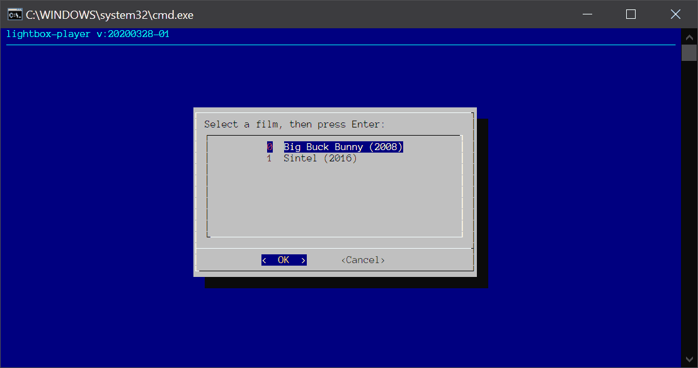
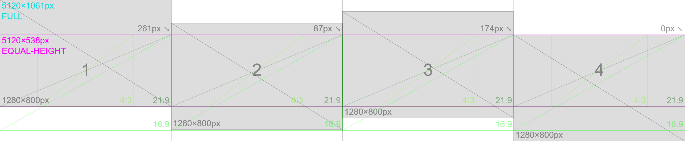
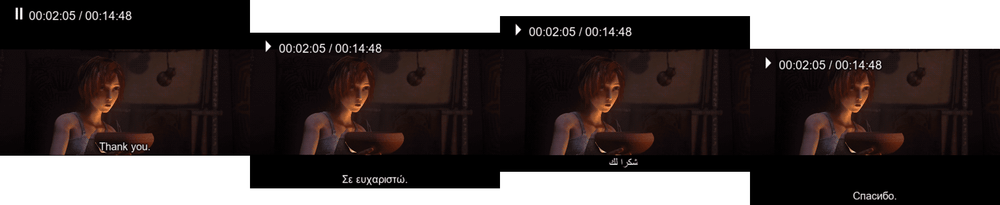

# /lightbox-player

The *lightbox-player* is a Bash script for Windows Subsystem for Linux, that allows playback of video files across multiple monitors, with different subtitles in each.

This script is designed to power and facilitate the physical constrains of [Lightbox](https://www.alphapivita.gr/projects/lightbox/), a portable projection unit for the screening of films with subtitles in different languages, enabling the participation and interaction of children from multiple cultural backgrounds.


## Operation

1. Double-click the `PLAY.bat` or `PLAY` file.*
2. Select one of the listed films with the arrow keys (or mouse) and hit <kbd>Enter</kbd> (or click OK).
3. The selected film plays on the connected monitors or projectors.
4. The script exits when playback is completed or interrupted.


*For keyboard-only control, use the arrows and hit <kbd>Enter</kbd> when the icon is highlighted.

## Additional controls

- Hit the <kbd>Esc</kbd> or <kbd>q</kbd> key at any point to interrupt the playback.
- Hit the <kbd>spacebar</kbd> to pause or unpause at any time, across all player instances.
- Use the <kbd>←</kbd> and <kbd>→</kbd> (left and right) arrow keys to rewind or skip respectively.
- Use the <kbd>0</kbd> and <kbd>9</kbd> keys to decrease or increase the audio levels.
- Hit the <kbd>O</kbd> to display elapsed / remaining playback time.

All [keyboard shortcusts](http://sheet.shiar.nl/mplayer) for  *Mplayer*’s playback apply, but subtitle or other controls may only apply on the first instance.


## Auto-discovery of video files

The script will search inside the `./FILMS` directory for subdirectories, which should contain at least one video file (*.mp4* / *.mkv* / *.mov* / *.avi* formats) and a number of subtitles (*.srt* format). The alphabetical order of the subtitle files determines which instance they will play at. When no video file is found within the selected directory, or when the operator selects `CANCEL` then a callibration video file is played instead.

### Example structure of `./FILMS` directory

```
├───FILMS
│   ├───Big Buck Bunny (2008)
│   ├───Sintel (2010)
│   │   └───1_Sintel.el.srt
│   │   └───2_Sintel.en.srt
│   │   └───3_Sintel.ar.srt
│   │   └───4_Sintel.fa.srt
│   │   └───Sintel (2010).mp4
│   └───...
```


## Technical description

The *lightbox-player* is designed to work with minimum input from the operator. It starts with double-clicking the `PLAY.bat` file, which in turn runs the `lightbox-player.sh` script without having to manually open a terminal. [Creating a shortcut](https://www.computerhope.com/issues/ch000739.htm) on the desktop allows to “hide” the script and related files elsewhere. Alternatively, the `PLAY.bat` file can be set to [run automatically on startup](https://www.computerhope.com/issues/ch000322.htm).

A graphical prompt allows the selection of films discovered in the preset `./FILMS` directory. If no video files are found within, then a default callibration routine will start playing in loop until interrupted with the <kbd>Esc</kbd> or <kbd>q</kbd> key.



The script used *Mplayer* to manage video and audio output, in a master-slave setup to synchronise playback across all instances. Because *Mplayer* is designed to work with the master and slave instances each on a different computer, *socat* is used to relay the required UDP data to additional slave instances on the same machine on different ports.

A few built-in Windows 10 utilities (*wmic.exe* and *powershell*) are used to obtain the width, height and number of monitors connected. These are used for entering the automatic *DEBUG mode* and creating as many instances as required.

The structure of the script and related files is reflected on the following graph:

```
├───CALLIBRATION        fallback media used for callibration
│   └───...             
├───FILMS               should contain the films to play
│   └───...             
├───MPLAYER             mplayer binaries
│   └───...             
├───lightbox-player.sh  the Bash script itself
├───PLAY.bat            Windows batch file to run the script

```

⚠️ Do not rename either the `./MPLAYER` or `./FILMS` directories. [Uppercase matters](https://devblogs.microsoft.com/commandline/per-directory-case-sensitivity-and-wsl/)!

When run on a computer with a single monitor connected, it automatically enters the *DEBUG mode* and simulates the physical 4-screen setup. Otherwise it will open in full-screen a number of player instances equal to the number of monitors or projectors connected (2-4). Only the player corresponding to the first monitor outputs audio.

Due to physical and technical constrains, each projection on the four sides of the *Lightbox* has a different position on the vertical axis. The projections are 1280×800px, while the screens translated to pixels (as built) are 1280×1061px each, for a total of 5120×1061px, which includes inactive areas. The “equal-height” area is 5120×538px. The following graphic illustrates the position of the projections on each screen, given the fact that projection (1) is aligned to the very top of its respective screen and projection (4) is aligned to the very bottom of its screen.



Films in Widescreen (21:9) format —or techically any ratio larger than, or equal to 2:1— are offset automatically to an “equal-height” area and this allows for a seamless active projection area across all sides.

⚠️  The monitors or projectors have to be in the appropriate order, otherwise the script will not work as intented when displaying Widescreen films. [MultiMonitorTool](http://www.nirsoft.net/utils/multi_monitor_tool.html) may be handy in this situation.



Films in other formats (16:9, 4:3 etc.) are positioned on the top of the projection area according to each physical screen.


The screenshots above show [*Sintel*](https://durian.blender.org/) and [*Big Buck Bunny*](https://peach.blender.org/), two open movies by the [Blender Institute](https://www.blender.org/about/projects/), available to watch and screen for free.


## Depedencies & Requirements

- Windows 10 and a few built-in utilities. Required for hardware compatibility with the physical device.
- [Windows Subsystem for Linux](https://docs.microsoft.com/en-us/windows/wsl/install-win10) (WSL). Installed through the Windows Store (e.g. Ubuntu).
- [Mplayer](http://www.mplayerhq.hu/) ([Windows x86_64 binary](https://oss.netfarm.it/mplayer/)) which is used for media playback. Install in the `./MPLAYER` directory, relative to the script. It’s important to use the Windows binary over one installed through WSL, as the latter does not properly support audio output and will fail to run.
- [socat](https://linux.die.net/man/1/socat) to allow *Mplayer* to connect to multiple slave instances. Install in WSL with `sudo apt install socat`.
- [bc](https://linux.die.net/man/1/bc) to allow non-integer calculations. Install in WSL with `sudo apt install bc`.

Before installing utilities in WSL, you may want to update the repository lists with `sudo apt-get update`.


## Future improvements

- [ ] Allow automatic playback of intro and outro sequence. (in progress)
- [ ] Allow playback of different video files or images per instance (requirement: exact same length) if discovered ont he same directory.
- [x] Use a static image in place of the callibration video.
- [ ] Align subtitles to screen (1) when in “equal-height” mode.
- [ ] Include a script to install depedencies automatically on the first use. May not install WSL automatically, but can fail gracefully instead.
- [x] When a video file’s width is beyond the width of the first connected screen, it should play in one instance instead of multiple.


## Known issues & Limitations

- Only works “as is” under Windows 10 as it uses a few built-in utilities. This is a “won’t-fix” limitation.
- The first time you use it, Windows Firewall will complain about *Mplayer*, and it’s necessary to allow it otherwise synchronised playback won’t work.
- May malfunction when more than 4 screens are connected.
- Sometimes, *wmic.exe* returns the wrong width if an additional monitor was previously connected. Only affects the *DEBUG mode*.


---
Made by [Heracles Papatheodorou](http://heracl.es) a.k.a [@Arty2](https://www.twitter.com/Arty2), [MIT Licence](LICENCE.txt)